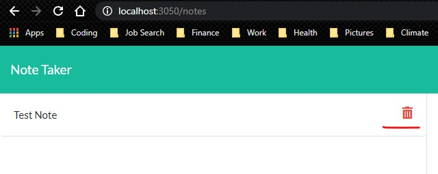

# Project:
  <strong>Express: Note Taker</strong>

  Deployable Link - > 

## Table of Contents: 
- [Project:](#project)
  - [Table of Contents:](#table-of-contents)
  - [License:](#license)
  - [Description:](#description)
  - [Images:](#images)
  - [Installation Instructions:](#installation-instructions)
  - [Test Command:](#test-command)
  - [My Github Username:](#my-github-username)
  - [My Email Address:](#my-email-address)
  - [Other Contributors:](#other-contributors)

## License:

## Description:
An application that can be used to write, save, and delete notes. This application uses an express backend and save and retrieve note data from a JSON file.

## Images:

## Installation Instructions: 
1) Install npm express
2) Install npm shortid
3) Recommended - Install npm nodemon

## Test Command: 
To test type Ensure that server is running then go to localhost:3050 in browser into the terminal

## My Github Username: 
Check out more projects on my Github at https://github.com/ReindeerCode

## My Email Address:
If you have any question please feel free to email me at ReindeerCode@gmail.com

## Other Contributors:
None at this time
